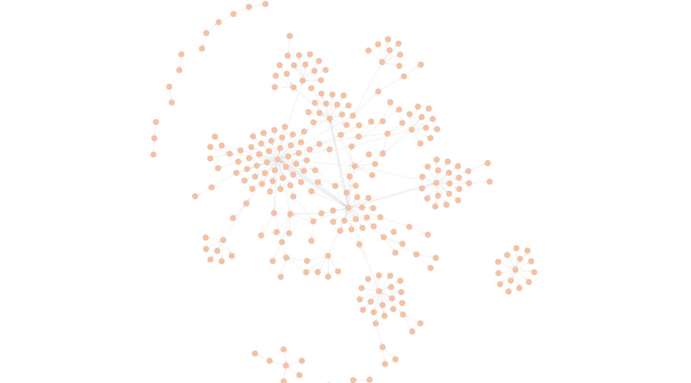
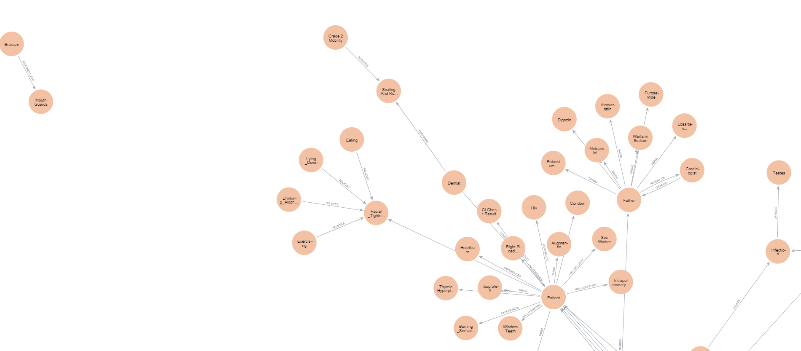
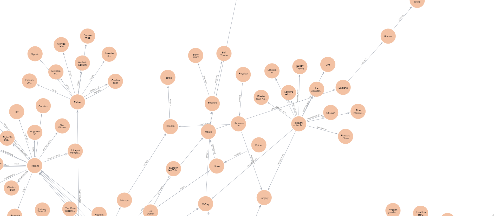

# Knowledge Graph and RAG for Language Models - GraphRAG🕸️

Welcome to the **AI Knowledge Graph Project**, where we're using cutting-edge Graph-based Reasoning, Retrieval-Augmented Generation (RAG), and Language Models to organize and extract structured knowledge from unstructured data.

  <figure style="display: inline-block; margin-right: 20px;">
    
    <figcaption align="center">Knowledge Graph made with 50 conversation</figcaption>
  </figure>

<!--  -->

## 🔍 Project Overview

This repository contains code and resources for building **graph-based knowledge systems** that integrate with **Neo4j** and **LangChain**. By leveraging **knowledge graphs**, we can efficiently retrieve relevant information and provide better context-aware responses using **Language Models** like GPT-4, LLAMA, MISTRAL. The  [dataset](./train_2kchat.jsonl) file is a JSON Lines (jsonl) format dataset containing a collection of conversational or textual data. Each line in the file is a valid JSON object(there is 2000 of them) representing a dialogue turn or textual snippet that will be parsed and fed into the knowledge graph. It is collected from [source](https://www.askadoctor24x7.com/community)

---

### 📜 Features

- **Neo4j Integration**: Build and query a **knowledge graph** using Neo4j to store nodes and relationships.
- **LangChain Integration**: Seamless use of Language Models to interact with the knowledge graph for better information extraction and reasoning.
- **GraphRAG Framework**: Employ **Retrieval-Augmented Generation (RAG)** for combining generative AI and knowledge graphs for enhanced retrieval.
- **Visualization**: View your knowledge graph visually to understand the relationships between data entities (like the one above).
  
---

## 💡 How It Works

This project extracts information from various unstructured text sources, and populates a **knowledge graph** in Neo4j, providing an efficient way to query and generate insights. The graph visualization shows relationships between concepts, making it easier to understand the connections between them.

---

## 🚀 Get Started

   

---

### 📂 Repository Structure

- `graphRAG_basic_neo4j_langchain.ipynb`: The core notebook that demonstrates building the knowledge graph with Neo4j and LangChain.
- `train_2kchat.jsonl`: Sample data for training or testing the graph-based RAG pipeline.
- `visualisation.png`: An example of the knowledge graph visualization.

---

### 📷 Graph Snapshorts

  
  
  

---

## 🛠️ Tech Stack

- **Neo4j**: Graph database to store knowledge nodes and relationships.
- **LangChain**: Framework for large language models, enabling connection to external tools and retrieval systems.
- **Python**: Primary language for building the backend system.

---

## 🎯 Future Goals
- **Chat Interface**: Have a chat interface for the user to talk to the dataset
- **Specialized Doc**: Train multiple llms on specialized dataset for example one for Dental Health, General Health, Orthologist, etc.

---

## 🤝 Contributing

I welcome contributions! Please open an issue or submit a pull request to discuss any improvements or new features you'd like to add.

---

Feel free to add, modify, or customize any of these sections to better suit the exact content of your repo! Let me know if you'd like specific changes or more sections.
